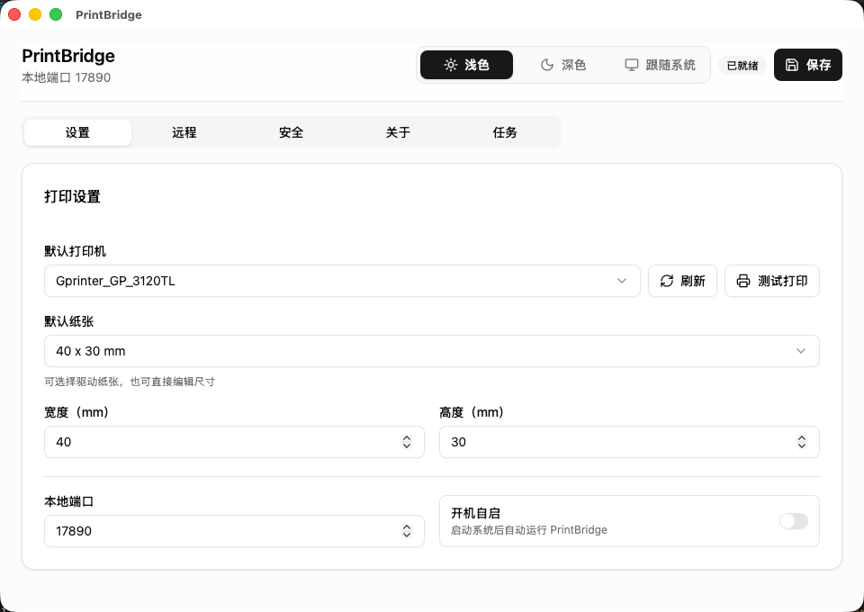
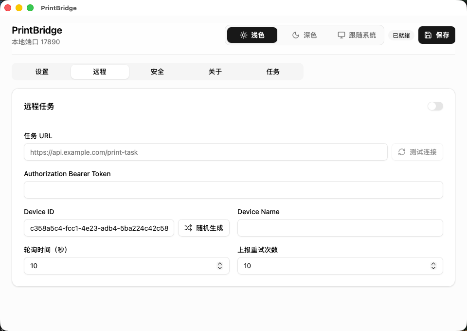
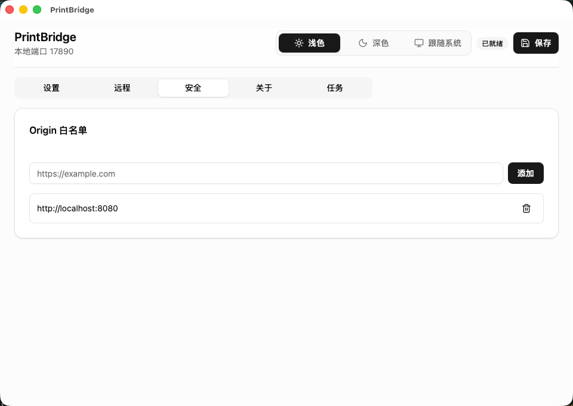

# PrintBridge

PrintBridge 是一个运行在用户电脑上的本地打印桥接程序。它让受信任的 Web 页面或远程业务服务器，把 PDF、图片、Office 文件和原始打印指令发送到本机打印队列，用于标签、面单、小票、报表等需要稳定静默打印的业务场景。

它不替代打印机驱动，也不绕过系统打印队列。PrintBridge 负责接收任务、校验来源、下载或转换文件，并把任务提交给本机操作系统；真正的出纸仍由系统打印队列、打印机驱动和打印机完成。

## 适合场景

- 仓库、门店、工位电脑常驻一个本地打印 Agent
- Web ERP、WMS、OMS、收银系统需要直接下发本机打印
- 标签、面单、小票、拣货单、发货单等需要减少人工选择打印机
- 业务服务器集中生成任务，本机 Agent 定时拉取并回报打印状态

## 核心能力

- 系统托盘常驻，默认隐藏主窗口
- 支持 Windows、macOS、Linux（后续增加： Linux daemon、 Docker）
- 本地 HTTP/WebSocket 服务
- Origin 白名单，用于限制哪些 Web 页面可以连接本机服务
- 支持 PDF、PNG/JPEG 图片、Office(.docx/.xlsx/.pptx) 文件和原始打印指令（Raw Commands）
- 每个任务可指定打印机；不指定时使用设置里的默认打印机
- 串行打印队列，避免同一台打印机并发抢占
- 可选远程任务轮询，从业务服务器拉取打印任务并回报结果
- 打印机枚举、纸张枚举、配置持久化和最近任务日志
- 配置可加密导出和导入，便于批量部署工位
- 在线更新版本

## 软件截图

|                                                         |                                                         |
| ------------------------------------------------------- | ------------------------------------------------------- |
|  |  |
|  |  |

## 安装

在 [Releases](https://github.com/vergil-lai/print-bridge/releases) 下载最新版本。

首次运行后，在 PrintBridge 设置界面完成：

1. 选择默认打印机
2. 选择或填写默认纸张
3. 把业务系统的 Origin 加入白名单，例如 `https://example.com`
4. 如果需要远程任务轮询，在“远程”选项卡填写任务 URL 并打开开关

## 接入方式

浏览器页面接入请使用 [`print-bridge-sdk`](https://github.com/vergil-lai/print-bridge-jssdk)。SDK 会连接本机 Agent 的 WebSocket 服务，并封装打印、批量打印、心跳和任务状态事件。

PrintBridge 也支持远程任务轮询模式：业务服务器维护待打印任务，本机 Agent 定时拉取任务、提交到系统打印队列，并把 `accepted`、`success`、`failed` 状态上报回服务器。

## 工作方式

```text
Web 页面 / 远程业务服务器
  |
  | WebSocket 下发任务，或 HTTP 轮询远程任务
  v
PrintBridge 本地 Agent
  |
  | 校验来源、下载文件、转换格式、进入串行队列
  v
系统打印队列
  |
  v
打印机驱动与打印机
```

WebSocket 里的 `submitted`，以及远程状态上报里的 `success`，表示任务已经成功提交到系统打印队列，不代表打印机已经完成出纸。

## 安全边界

PrintBridge 运行在用户本机，能够访问本机打印机。部署时请至少做到：

- 只把可信业务系统加入 Origin 白名单
- 不要把本地服务端口暴露到不可信网络
- 在业务系统侧控制谁能发起打印、能打印哪些文件
- 不要把敏感文件 URL 暴露给不可信页面

## 技术文档

README 只保留产品介绍和入口说明。具体协议、API、配置格式、开发命令和平台细节请看：

- [技术说明](docs/printbridge-technical.md)
- [远程任务服务器示例](examples/remote-task/README.md)
- [JS SDK](https://github.com/vergil-lai/print-bridge-jssdk)

## License

[MIT](./LICENSE)。

Windows 版本随包使用的 SumatraPDF 适用其自身许可证。详见 [THIRD_PARTY_NOTICES.md](./THIRD_PARTY_NOTICES.md)。
