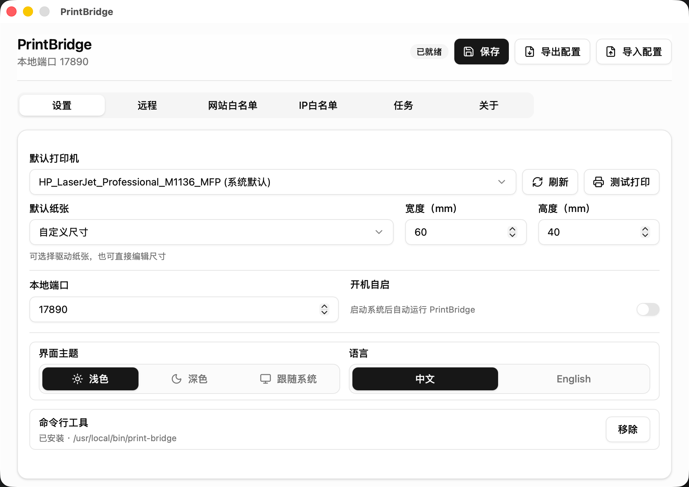
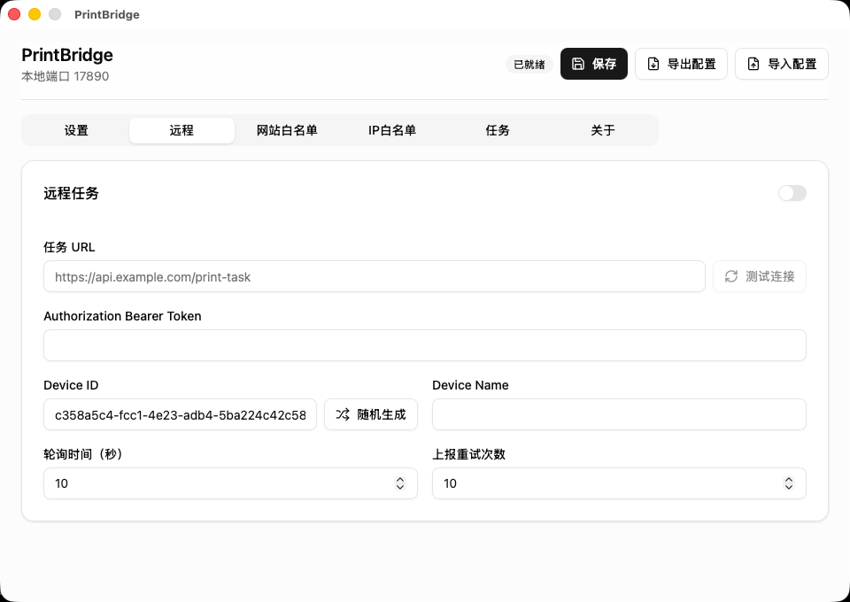
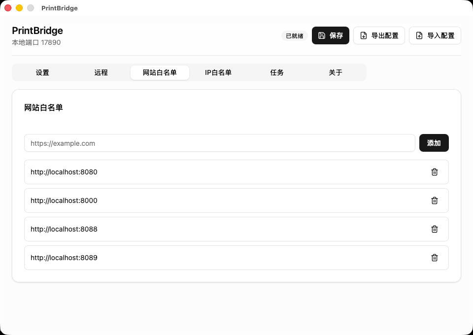
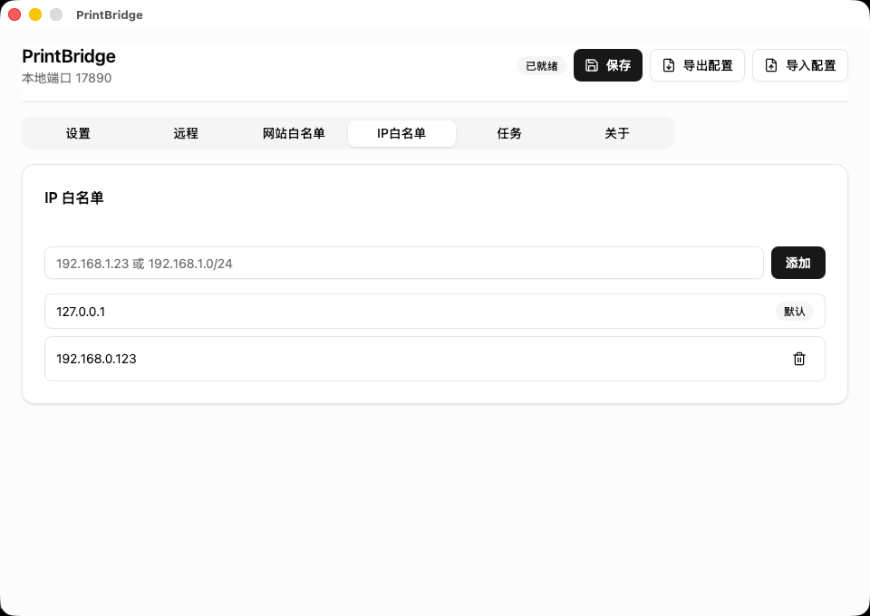
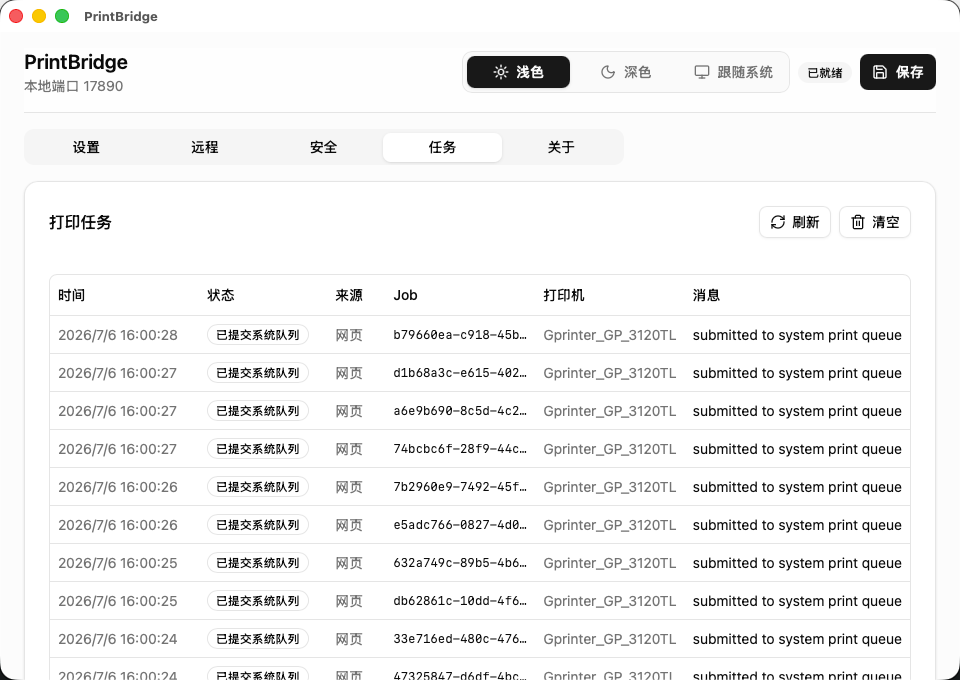
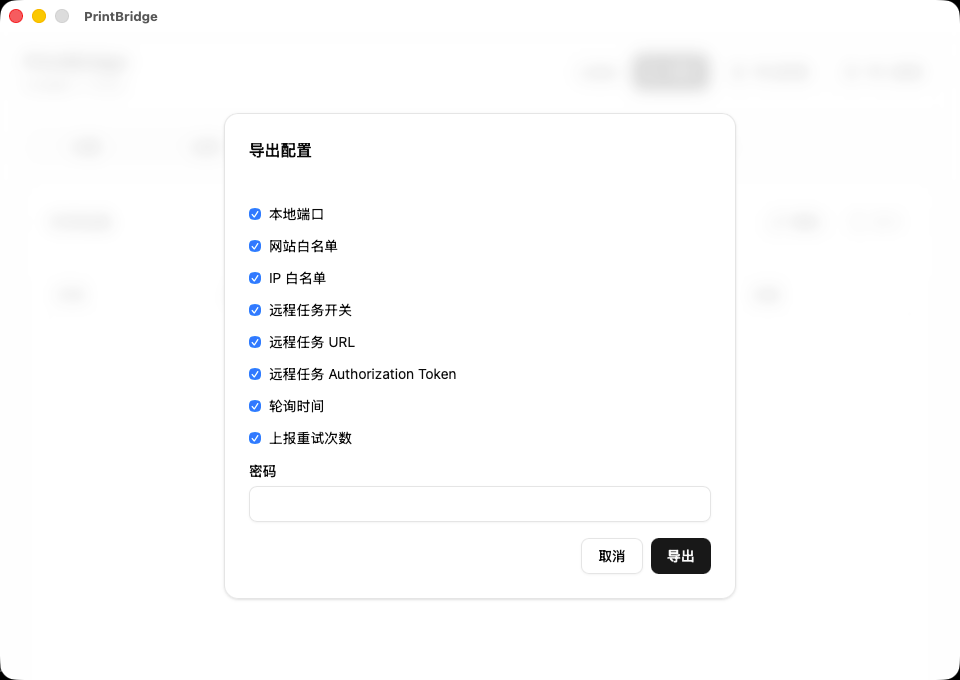

# PrintBridge

[English](./README_en.md)

PrintBridge 是一个运行在用户电脑上的本地打印代理程序。它让受信任的 Web 页面或远程业务服务器，把 PDF、图片、Office 文件和原始打印指令发送到本机打印队列，用于标签、面单、小票、报表等需要稳定静默打印的业务场景。

它不替代打印机驱动，也不绕过系统打印队列。PrintBridge 负责接收任务、校验来源、下载或转换文件，并把任务提交给本机操作系统；真正的出纸仍由系统打印队列、打印机驱动和打印机完成。

## 适合场景

- 仓库、门店、工位电脑常驻一个本地打印代理
- Web ERP、WMS、OMS、收银系统需要直接下发本机打印
- 标签、面单、小票、拣货单、发货单等需要减少人工选择打印机
- 业务服务器集中生成任务，本机代理定时拉取并回报打印状态

## 核心能力

- 系统托盘常驻，默认隐藏主窗口
- 支持 Windows、macOS、Linux（后续增加： Linux daemon、 Docker）
- 本地 HTTP/WebSocket 服务
- 网站白名单（Origin 白名单），用于限制哪些 Web 页面可以连接本机服务，例如 `https://example.com`
- IP 白名单，用于限制哪些客户端地址可以访问本机服务，支持单个 IP 和 CIDR 网段
- 支持 PDF、PNG/JPEG 图片和 Office(.docx/.xlsx/.pptx) 文件
- 支持原始打印指令 (Raw Commands)，原样提交 ESC/POS、TSPL、ZPL、EPL、PCL 等设备指令
- 每个任务可指定打印机和纸张尺寸；不指定时使用设置里的默认值。
- 串行打印队列，避免同一台打印机并发抢占
- 远程任务轮询，适合工位、门店、仓库终端自动拉取打印任务
- CLI 运维模式，可在不打开 GUI 时查看和修改本机配置
- 打印机枚举、纸张枚举、配置持久化和最近任务日志
- 配置可加密导出和导入，便于批量部署工位
- 在线更新版本

## 远程任务轮询

PrintBridge 可以作为工位、门店或仓库终端上的本地代理，定时从业务服务器拉取打印任务，并把执行状态回报给服务器。

这适合“系统产生任务，指定终端自动打印”的场景，例如生产标签、仓库面单、拣货单、收银小票等。

## 原始打印指令

PrintBridge 支持原始打印指令（Raw Commands）。业务系统可以自己生成 ESC/POS、TSPL、ZPL、EPL、PCL、PostScript 等设备指令，PrintBridge 只负责把 bytes 原样提交到系统打印队列。

这适合标签机、小票机和工业打印设备。PrintBridge 不解析这些设备语言，也不负责生成标签、小票或 RFID 指令。

## 和传统 Web 打印控件的区别

PrintBridge 不是传统意义上的 Web 打印控件。[C-Lodop / Lodop](https://www.lodop.ne) 更擅长打印设计、套打、表格、条码和页面内容打印；PrintBridge 更关注开源本地打印代理、远程任务轮询、原始打印指令（Raw Commands）、CLI 运维和可私有化集成。

如果业务系统已经生成好 PDF、图片、Office 文件或 ESC/POS、TSPL、ZPL、EPL、PCL 等设备指令，PrintBridge 会更像一个稳定、可审计、可改造的本机打印桥接层。

## 软件截图

<p>
  
  
</p>

<p>
  
  
</p>

<p>
  
  
</p>

## 安装

在 [Releases](https://github.com/vergil-lai/print-bridge/releases) 下载最新版本。

首次运行后，在 PrintBridge 设置界面完成：

1. 选择默认打印机
2. 选择或填写默认纸张
3. 在“网站白名单”中加入业务系统的 Origin，例如 `https://example.com`
4. 保留默认 IP 白名单 `127.0.0.1`；如需让局域网设备连接，再添加明确的 IP 或网段，例如 `192.168.1.10`、`192.168.1.0/24`
5. 如果需要远程任务轮询，在“远程”选项卡填写任务 URL 并打开开关

## CLI 模式

PrintBridge 提供 `print-bridge` CLI，用于在不打开 GUI 的情况下完成基础运维和诊断：

```bash
print-bridge printer
print-bridge printer set-default "Printer Name"

print-bridge paper
print-bridge paper set 60 40

print-bridge origin add "https://example.com"

print-bridge remote enable
print-bridge remote set-url "https://example.com/print-task"

print-bridge task
print-bridge serve
```

`print-bridge serve` 会以前台进程方式启动无 GUI Agent，适合由 systemd、launchd、Docker 或 supervisor 托管为后台服务。

CLI 直接读写与 GUI 相同的本机配置，并可查看本地任务历史。完整命令见 [技术说明](docs/printbridge-technical.md#cli-运维入口)。

## 接入方式

浏览器页面接入请使用 [`print-bridge-sdk`](https://github.com/vergil-lai/print-bridge-jssdk)。SDK 会连接本机代理 的 WebSocket 服务，并封装打印、批量打印、心跳和任务状态事件。

PrintBridge 也支持远程任务轮询模式：业务服务器维护待打印任务，本机代理定时拉取任务、提交到系统打印队列，并把 `accepted`、`success`、`failed` 状态上报回服务器。

## 工作方式

```text
Web 页面 / 远程业务服务器
  |
  | WebSocket 下发任务，或 HTTP 轮询远程任务
  v
PrintBridge
  |
  | 校验来源、下载文件、转换格式、进入串行队列
  v
系统打印队列
  |
  v
打印机驱动与打印机
```

WebSocket 里的 `submitted`，以及远程状态上报里的 `success`，表示任务已经成功提交到系统打印队列，不代表打印机已经完成出纸。

## 安全边界

PrintBridge 运行在用户本机，能够访问本机打印机。部署时请至少做到：

- 只把可信业务系统加入网站白名单；这里校验的是浏览器页面的 Origin
- 只把可信客户端 IP 或网段加入 IP 白名单；默认 `127.0.0.1` 不可删除
- 即使本地服务监听局域网地址，也不要把服务端口暴露到不可信网络
- 在业务系统侧控制谁能发起打印、能打印哪些文件
- 不要把敏感文件 URL 暴露给不可信页面

## 技术文档

具体协议、API、配置格式、开发命令和平台细节请看：

- [技术说明](docs/printbridge-technical.md)
- [远程任务服务器示例](examples/remote-task/README.md)
- [JS SDK](https://github.com/vergil-lai/print-bridge-jssdk)

## License

[Apache License 2.0](./LICENSE)。

Windows 版本随包使用的 SumatraPDF 适用其自身许可证。详见 [THIRD_PARTY_NOTICES.md](./THIRD_PARTY_NOTICES.md)。
