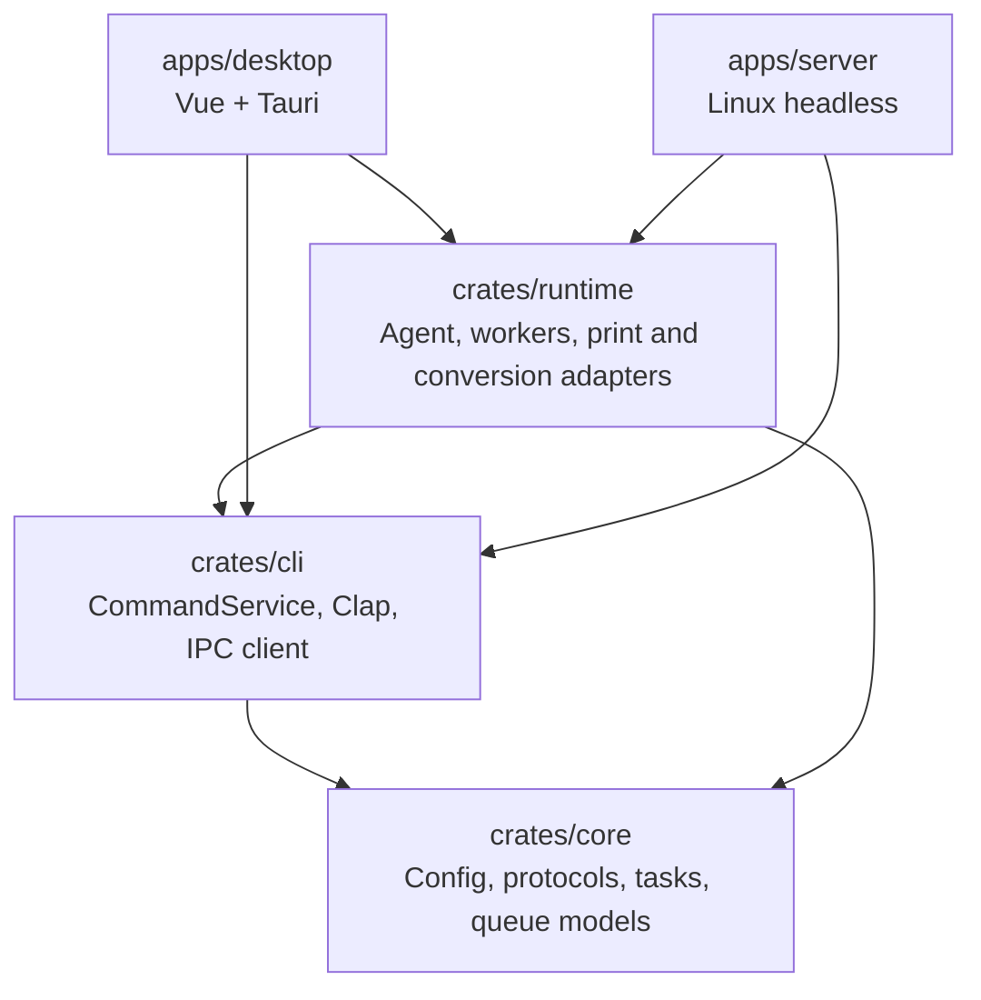
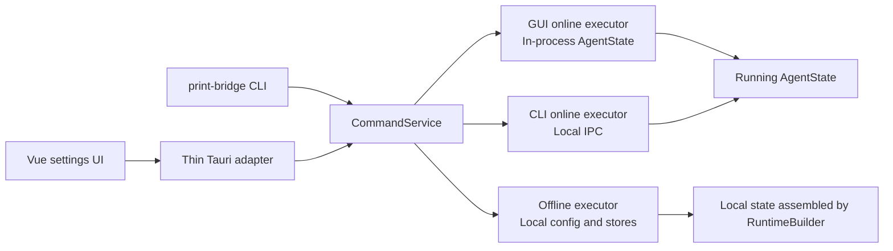

# PrintBridge Technical Documentation

[中文](./printbridge-technical.md)

## Tech Stack

| Layer             | Technology                                                                           |
| ----------------- | ------------------------------------------------------------------------------------ |
| Framework         | [Tauri 2](https://v2.tauri.app/)                                                     |
| Frontend          | [Vue 3](https://vuejs.org/) + [TypeScript](https://www.typescriptlang.org/)          |
| UI                | [shadcn-vue](https://www.shadcn-vue.com/) + [Tailwind CSS](https://tailwindcss.com/) |
| Build             | [Vite](https://vite.dev/)                                                            |
| Backend           | Rust + [Axum](https://docs.rs/axum/latest/axum/) + [Tokio](https://tokio.rs/)        |
| Storage           | JSON config file + [SQLite](https://www.sqlite.org/)                                 |
| Office conversion | Microsoft Office (Windows) / LibreOffice (macOS/Linux)                         |
| Platform printing | [SumatraPDF](https://www.sumatrapdfreader.org/)(Windows) / CUPS `lp` (macOS/Linux)   |

## Current Architecture

PrintBridge is a Cargo workspace that separates pure domain models, runtime capabilities, functional commands, and final products. The Vue frontend belongs to the complete desktop product, so it lives under `apps/desktop` instead of a Rust crate.

```text
PrintBridge/
├── Cargo.toml
├── crates/
│   ├── core/       # Pure models and rules
│   ├── cli/        # Shared functional commands, Clap parser, local IPC client
│   └── runtime/    # Agent state, workers, platform adapters, WebSocket, local IPC server
├── apps/
│   ├── desktop/
│   │   ├── src/            # Vue 3 frontend
│   │   └── src-tauri/      # Tauri product entry and thin IPC adapters
│   └── server/             # Linux headless product, systemd, deb/rpm packaging
├── scripts/
└── docs/
```

### Dependency Direction



`crates/core` has no dependency on Tauri, Axum, Clap, or SQLite. `apps/desktop` and `apps/server` only own product entrypoints, platform paths, lifecycle composition, and packaging. They do not duplicate queue, configuration, or printing logic.

### Crate Responsibilities

| Module | Owns | Does not own |
| --- | --- | --- |
| `crates/core` | `AgentConfig`, WebSocket/remote protocols, IP/Origin validation, print models, queue models, task-history DTOs | Product filesystem paths, SQLite, network listeners, Tauri |
| `crates/cli` | Typed `Command` / `CommandResult`, `CommandService`, Clap parser, config transfer, local IPC client | Agent startup, print workers, Tauri UI |
| `crates/runtime` | `AgentState`, `RuntimeBuilder`, `AgentRuntime`, queue and remote workers, SQLite stores, print/Office/HTML adapters, WebSocket and local IPC server | GUI, systemd package scripts, product argument dispatch |
| `apps/desktop` | Vue settings UI, Tauri commands, tray, autostart, desktop packaging | REST API, domain rules, headless `serve` |
| `apps/server` | `serve` entrypoint, fixed Linux paths, dependency preflight, signals/systemd readiness, deb/rpm | GUI, desktop tray, per-user service installation |

### Shared Functional Commands

Settings, printer and paper queries, logs, task history, config transfer, remote connection tests, and test printing are represented as `crates/cli::Command`. The GUI and Clap parser do not directly mutate config files, SQLite, or print backends. Both call the same `CommandService`.



Command policies are:

- `OnlineOnly`: must run inside the active Agent, including status, in-memory logs, remote connection tests, and test printing.
- `OnlinePreferred`: first use the active Agent; offline execution is allowed only after an explicit `NotRunning` result.
- `OfflineAllowed`: may execute directly through the offline executor, such as config-file validation.

Permission failures, IPC protocol failures, and runtime errors are never interpreted as “Agent not running,” so they cannot silently fall back and create split state.

### Local IPC

External CLI management of a running Agent does not use HTTP. Unix uses `agent.sock` inside the runtime directory with mode `0660`; Windows uses a stable named pipe. Requests and responses use JSON envelopes containing `protocol_version` and `request_id`. Each envelope is wrapped in a 4-byte big-endian length frame with an 8 MiB maximum. The GUI Tauri adapter runs in the Agent process and calls the same `CommandService` directly; it does not spawn a subprocess or parse CLI stdout.

Desktop stores its runtime directory under `run/` in the application config directory. Linux headless uses `/run/print-bridge/agent.sock`. The IPC server shares the same cancellation signal as WebSocket, the queue worker, and the remote worker, and `AgentHandle` waits for all of them during shutdown.

### Agent Lifecycle

`RuntimeBuilder` creates directories, reads `config.json`, opens `task_history.sqlite3` and `remote.sqlite3`, and injects the platform print backend and HTML renderer. `AgentRuntime::start()` binds the WebSocket and local IPC listeners, starts the queue and remote workers, and returns `AgentHandle`.

During shutdown, `AgentHandle::shutdown()` stops accepting new connections, cancels background workers, waits for active work to exit, and removes the Unix socket. Headless sends systemd `READY=1` only after every component starts successfully and sends `STOPPING=1` before shutdown.

### Two Products

The products use different package identities but each ships only a binary named `print-bridge`:

| Product | Package | No-argument behavior | `serve` |
| --- | --- | --- | --- |
| Desktop | `print-bridge-desktop` | Launch the GUI | Explicitly rejected |
| Linux headless | `print-bridge-server` | Show CLI help | `print-bridge serve` explicitly starts the Agent |

Linux desktop and headless packages conflict in both directions. They cannot be installed together and neither package automatically replaces the other. Headless installation creates the `printbridge` system user and enables a system-level systemd service.

### Network Boundary

The Axum router exposes only `GET /ws`. Configuration, printers, papers, logs, task history, and test printing have no REST API. WebSocket connections are checked against both the client IP allowlist and the browser Origin allowlist. Print jobs, query messages, ping/pong, and job-status events continue to use the existing WebSocket protocol.

## Product Boundaries

PrintBridge is a local print agent. It is not a printer driver and does not replace the system print queue.

- `service.host` remains a compatibility field with the value `127.0.0.1`; the service currently binds to `0.0.0.0:{port}`.
- Browser-side print tasks are primarily submitted through WebSocket `/ws`.
- The network security model combines a client IP allowlist with a WebSocket Origin allowlist.
- The print queue is executed serially.
- `submitted` / `success` means the job has been submitted to the system print queue. It does not mean that the printer has physically finished printing.
- Windows uses the bundled SumatraPDF binary.
- macOS and Linux use system CUPS command-line tools.

## Supported Inputs

The current version is designed for these input types:

- PDF
- PNG/JPEG images. Tasks may use `format: "image"`; the local service detects the actual file content.
- DOCX/XLSX/PPTX Office files. Windows uses the locally installed Microsoft Word, Excel, or PowerPoint application for the matching format; macOS/Linux uses the locally installed LibreOffice. PrintBridge converts the file to a temporary PDF before submitting it to the system print queue. Rendering depends on the local Office software, fonts, and operating-system environment.
- Raw printer commands. Use `format: "raw"` and inline `data_base64`.

### Office Conversion

Office files are first identified from their OOXML container contents, then copied into a task-specific temporary directory with the correct extension. On macOS/Linux, LibreOffice runs headlessly with an isolated user profile, the highest macro-security level, and no trusted locations. On Windows, conversion uses the COM automation interface of Word, Excel, or PowerPoint.

Each conversion is limited to 120 seconds. PrintBridge verifies that the output exists, is non-empty, and begins with `%PDF-`, then removes temporary files. On Windows timeout, it confirms ownership using the process PID, start time, and process name, then terminates only the Office instance started for that task; existing user Office sessions remain untouched.

Raw mode can carry ESC/POS, TSPL, TSPL2, ZPL, EPL, PCL, PostScript, and similar device commands generated by the caller. PrintBridge only submits the bytes to the system print queue as-is. It does not parse these commands and does not generate labels, receipts, or RFID commands.

Raw tasks do not support `file_url`, `paper`, or `copies`. If the business workflow needs multiple raw outputs, generate multiple raw command payloads or send multiple jobs.

HTML mode supports `html` and `raw-html`: the local Agent downloads and renders the URL page for the former, and renders caller-provided HTML text for the latter. Both are converted to a temporary PDF before entering the normal PDF print flow.

## Development

Install dependencies:

```bash
pnpm install --frozen-lockfile
```

Start the Tauri development app:

```bash
pnpm --dir apps/desktop tauri dev
```

Tauri also starts the Vite development server:

```text
http://localhost:1420/
```

The local service listens on:

```text
0.0.0.0:17890
```

Web pages on the same machine usually connect through `127.0.0.1`. LAN devices can connect through the computer's LAN IP, such as `192.168.1.23`, when the IP allowlist permits it.

## Initial Configuration

After first launch, configure PrintBridge in the settings UI:

1. Select the default printer
2. Select or enter the default paper size
3. Add your business system Origin to the allowlist, for example `https://example.com`
4. If remote task polling is needed, enter the task URL in the Remote tab and enable it

The Origin must exactly match the browser WebSocket handshake `Origin`, including scheme, host, and port. Examples:

```text
http://localhost:5173
https://example.com
```

The allowlist validates the source page that opens the connection. It does not validate the domain of the file being printed.

## CLI Operations

PrintBridge provides a `print-bridge` CLI for inspecting and changing functional state without opening the GUI. Desktop and headless share the Clap parser in `crates/cli`. Commands that permit offline execution can run without an Agent; `OnlineOnly` operations such as status, in-memory logs, connection tests, and test printing require a running Agent.

```bash
print-bridge printer
print-bridge printer "Printer Name"
print-bridge printer set-default "Printer Name"

print-bridge paper
print-bridge paper set 60 40

print-bridge origin
print-bridge origin add "https://example.com"
print-bridge origin delete "https://example.com"

print-bridge remote
print-bridge remote enable
print-bridge remote disable
print-bridge remote set-url "https://example.com/print-task"
print-bridge remote set-token "token"
print-bridge remote set-device-id "factory-pi-01"
print-bridge remote set-device-name "packing-station-01"
print-bridge remote set-interval 10

print-bridge task
print-bridge task "JOB-001"
print-bridge task clear
print-bridge status
print-bridge logs
print-bridge test-remote
print-bridge test-print

# Available only in the Linux headless product
print-bridge serve
```

The CLI and GUI share the strongly typed `CommandService`; the GUI executes commands in process, while an external CLI calls a running Agent over local IPC. `serve` exists only in the Linux headless product.

## Headless Linux deployment

`print-bridge serve` exists only in `print-bridge-server`. Installing the deb/rpm creates the `printbridge` system user and enables `print-bridge.service`; the desktop product rejects `serve`. GUI and headless packages conflict in both directions, upgrades preserve data, and only purge removes `/etc/print-bridge` and `/var/lib/print-bridge`.

The service uses `Type=notify`; config, state, and runtime directories are `/etc/print-bridge`, `/var/lib/print-bridge`, and `/run/print-bridge`. Diagnose with `systemctl status print-bridge`, `journalctl -u print-bridge`, or `print-bridge status`.

## Configuration Export and Import

The settings UI can export selected configuration fields to an encrypted JSON file and import configuration from such a file. The default export file name is:

```text
printbridge-config.json
```

The export dialog can include these fields, all selected by default:

- Local port
- Origin allowlist
- Remote task switch
- Remote task URL
- Remote task Authorization Token
- Poll interval
- Report retry count

Export requires a password. The password may be empty; an empty password still uses the same encryption flow. If Authorization Token is selected and the password is empty, the UI requires an additional confirmation.

Import requires selecting a file and entering the password used during export. The UI shows a preview before applying the import. Only fields contained in the file are overwritten; fields not present in the file keep their current values.

Authorization Token has an additional protection rule: if the token field is missing, `null`, or an empty string, the current token is preserved. Only a non-empty string overwrites the current token.

The encrypted file is a JSON envelope. The internal config payload is encrypted with Argon2id v1.3 and AES-256-GCM:

```json
{
  "format": "printbridge-config-encrypted",
  "version": 1,
  "crypto": {
    "kdf": "argon2id13",
    "memory_kib": 19456,
    "iterations": 2,
    "parallelism": 1,
    "cipher": "aes-256-gcm",
    "tag_bytes": 16,
    "salt": "<base64>",
    "nonce": "<base64>"
  },
  "payload": "<base64(ciphertext || tag)>"
}
```

The decrypted payload has this format:

```json
{
  "format": "printbridge-config",
  "version": 1,
  "config": {
    "service": {
      "port": 17890
    }
  }
}
```

ERP systems or other tools that need to generate importable config files can refer to the PHP, Go, and Node implementations under `examples/config-transfer/`. The desktop project provides a shared verification command:

```bash
pnpm --dir apps/desktop verify:config-transfer-examples
```

## Local management and WebSocket

The network router exposes only `GET /ws`. Desktop settings, config transfer, logs, task history, and test printing all use `CommandService`: the GUI uses in-process Tauri adapters and external CLI clients use local IPC. No REST API is provided. Check runtime status with `print-bridge status`, systemd notify, or WebSocket ping/pong.

Configuration example:

```json
{
  "service": {
    "host": "127.0.0.1",
    "port": 17890
  },
  "security": {
    "allowed_origins": []
  },
  "printing": {
    "default_printer": null,
    "default_paper": null,
    "default_copies": 1
  },
  "limits": {
    "max_file_size_mb": 20,
    "max_batch_jobs": 20,
    "max_copies": 100,
    "download_timeout_seconds": 30
  },
  "app": {
    "autostart": false
  },
  "remote": {
    "enabled": false,
    "endpoint_url": null,
    "bearer_token": null,
    "device_id": null,
    "device_name": null,
    "poll_interval_seconds": 10,
    "max_report_retries": 10,
    "history_retention_days": 3
  }
}
```

`service.host` is a compatibility field and remains `127.0.0.1` when saved. The local service currently binds to all network interfaces.

## WebSocket API

Connection URL:

```text
ws://127.0.0.1:17890/ws
```

The local service validates `Origin` during the browser WebSocket handshake. Connections from non-allowlisted Origins are rejected.

### Heartbeat

Request:

```json
{
  "type": "ping",
  "time": 1780000000000
}
```

Response:

```json
{
  "type": "pong",
  "time": 1780000000000
}
```

### Single Print Task

```json
{
  "type": "print",
  "request_id": "REQ-001",
  "job_id": "JOB-001",
  "format": "pdf",
  "printer_name": "Office Printer",
  "file_url": "https://example.com/label.pdf",
  "copies": 1,
  "paper": {
    "width_mm": 60,
    "height_mm": 40
  }
}
```

`printer_name` may be omitted. When omitted, PrintBridge uses the configured default printer. `paper` may also be omitted. When omitted, PrintBridge uses the configured default paper.

Office task:

```json
{
  "type": "print",
  "request_id": "REQ-OFFICE-001",
  "job_id": "JOB-OFFICE-001",
  "format": "docx",
  "file_url": "https://example.com/report.docx",
  "copies": 1,
  "paper": {
    "width_mm": 210,
    "height_mm": 297
  }
}
```

Office files support `docx`, `xlsx`, and `pptx`. The local service uses the current platform's installed Office software to create a temporary PDF before entering the PDF print flow. Windows requires Microsoft Word, Excel, or PowerPoint for the matching format; macOS/Linux requires LibreOffice. Office tasks only support HTTP(S) `file_url`; data URLs are not supported. The task enters `failed` when the required software is unavailable, conversion fails, or conversion exceeds 120 seconds.

HTML URL task:

```json
{
  "type": "print",
  "request_id": "REQ-HTML-001",
  "job_id": "JOB-HTML-001",
  "format": "html",
  "file_url": "https://example.com/invoice/1",
  "wait_ms": 1000,
  "copies": 1,
  "paper": {
    "width_mm": 210,
    "height_mm": 297
  }
}
```

Inline HTML task:

```json
{
  "type": "print",
  "request_id": "REQ-RAW-HTML-001",
  "job_id": "JOB-RAW-HTML-001",
  "format": "raw-html",
  "html": "<main><h1>Invoice</h1></main>",
  "wait_ms": 1000,
  "copies": 1,
  "paper": {
    "width_mm": 210,
    "height_mm": 297
  }
}
```

`html` requires an HTTP(S) `file_url` and does not accept inline `html` or `data_base64`; `raw-html` requires a non-empty `html` and does not accept `file_url` or `data_base64`. Both HTML task types accept `wait_ms` from 0 to 30000 milliseconds and support `copies` and `paper`.

The browser JSSDK uses `fileUrl` and `waitMs` and only serializes protocol fields. The local Agent downloads, renders, and prints HTML as PDF. The HTML page and every loaded resource, including CSS, images, and scripts, may use only public HTTP/HTTPS addresses; `file:`, local, and private-network addresses are rejected.

### HTML Rendering Prerequisites and Timeout Boundary

HTML rendering does not bundle a browser. Every platform and runtime mode requires an installed Chromium-family browser; native WebView fallbacks are not provided:

| Platform | Browser renderer |
| --- | --- |
| Windows | Edge → Chrome → Chromium |
| macOS | Chrome → Chromium |
| Linux | Chrome → Chromium |

Both the GUI and `print-bridge serve`, including systemd-managed headless package deployments, follow this requirement. Without a usable browser, an HTML task returns a renderer-unavailable (`RendererUnavailable`) failure.

The proxy still safely blocks a rejected resource without `Referer` or `Origin`; however, it cannot reliably associate that request with the current HTML page. Task history may therefore omit `BlockedResource`, and the resulting PDF may omit that resource.

Rendering uses cooperative cancellation at a total deadline: after timeout it does not start later browser stages; an already-started synchronous browser operation returns through its own bounded wait before resources are cleaned up. It does not promise immediate cross-process termination.

Raw task:

```json
{
  "type": "print",
  "request_id": "REQ-RAW-001",
  "job_id": "JOB-RAW-001",
  "format": "raw",
  "printer_name": "TSC TE244",
  "data_base64": "XlhB..."
}
```

Raw tasks do not support `file_url`, `paper`, or `copies`. Parameters such as paper size, gap, copies, text, barcode, and RFID for TSPL/TSPL2-style label commands must be encoded by the business system inside the raw command content.

### Batch Print Task

```json
{
  "type": "print_batch",
  "request_id": "REQ-002",
  "batch_id": "BATCH-001",
  "jobs": [
    {
      "job_id": "A-001",
      "format": "image",
      "file_url": "https://example.com/a.png",
      "copies": 1
    },
    {
      "job_id": "B-001",
      "format": "raw",
      "printer_name": "TSC TE244",
      "data_base64": "XlhB..."
    }
  ]
}
```

A batch task only means that multiple jobs are received in one request. Execution still uses the same serial queue. A batch can mix PDF, image, Office, and raw jobs.

### Job Status

After a task is accepted, the local service returns or pushes `job_status`:

```json
{
  "type": "job_status",
  "request_id": "REQ-001",
  "job_id": "JOB-001",
  "status": "queued",
  "message": "queued"
}
```

Status values:

```text
queued
downloading
printing
submitted
completed
failed
unknown
cancelled
```

## Remote Task Polling

Remote task polling is for deployments where the business server owns the print task queue, and PrintBridge only polls and prints from the user's local machine.

When enabled, PrintBridge uses the same `remote.endpoint_url` for two requests:

```text
GET  {endpoint_url}  fetch tasks
POST {endpoint_url}  report task status
```

If `bearer_token` is configured, requests include:

```text
Authorization: Bearer <bearer_token>
```

If device identity fields are configured, requests also include:

```text
X-PrintBridge-Device-Id: <device_id>
X-PrintBridge-Device-Name: <device_name>
```

`device_id` and `device_name` are optional. If only one is configured, only that header and report field are sent. The UI's "generate random" button creates a UUID v4 as `device_id`.

### Fetching Tasks

The `GET` response may be empty, `null`, a single task object, or an array of task objects. Single task example:

```json
{
  "type": "print",
  "request_id": "REQ-001",
  "job_id": "JOB-001",
  "format": "pdf",
  "file_url": "https://example.com/label.pdf",
  "copies": 1
}
```

Raw task example:

```json
{
  "type": "print",
  "request_id": "REQ-RAW-001",
  "job_id": "JOB-RAW-001",
  "format": "raw",
  "printer_name": "TSC TE244",
  "data_base64": "XlhB..."
}
```

Batch task example:

```json
{
  "type": "print_batch",
  "request_id": "REQ-002",
  "batch_id": "BATCH-001",
  "jobs": [
    {
      "job_id": "A-001",
      "format": "image",
      "file_url": "https://example.com/a.png",
      "copies": 1
    },
    {
      "job_id": "B-001",
      "format": "image",
      "file_url": "https://example.com/b.jpg",
      "copies": 2
    }
  ]
}
```

Remote tasks use the same print fields as WebSocket tasks. `job_id` is the remote deduplication key. A `job_id` already recorded locally is ignored and will not be queued again.

### Status Reporting

PrintBridge reports only three statuses to the remote server:

```text
accepted
success
failed
```

Local queue statuses are mapped as follows:

```text
queued    -> accepted
submitted -> success
failed    -> failed
cancelled -> failed
```

`downloading`, `printing`, `completed`, and `unknown` remain local-only statuses for logs, task history, and WebSocket status events. They are not reported to the remote server.

Status report body example:

```json
{
  "event": "status",
  "event_id": "8c3f0f3a-0f6c-44c1-9e8e-1f0a60f5c813",
  "request_id": "REQ-001",
  "job_id": "JOB-001",
  "status": "success",
  "message": "submitted to system print queue",
  "occurred_at": "2026-07-06T10:00:00Z",
  "device_id": "f77160d2-fa59-4ddb-93d9-205cd2dec3ac",
  "device_name": "packing-station-01"
}
```

`event_id` is generated locally by PrintBridge as UUID v4 and persisted in SQLite. Remote servers can use it as an idempotency key.

PrintBridge treats only HTTP `2xx` responses as successful reports. Network errors or non-`2xx` responses are retried according to `max_report_retries`, defaulting to 10 retries. `401`, `403`, and `404` are treated as configuration errors. Remote polling and status reporting are paused until the user updates the configuration.

When saving remote config or clicking "test connection", PrintBridge tests both `GET` and `POST` against the same URL. Test requests include:

```text
X-PrintBridge-Test: true
```

## Verification

Frontend checks:

```bash
pnpm --dir apps/desktop typecheck
pnpm --dir apps/desktop lint
pnpm --dir apps/desktop build
```

Rust checks:

```bash
cargo fmt --all -- --check
cargo check --workspace
cargo clippy --workspace --all-targets -- -D warnings
cargo test --workspace
```

Some Rust tests bind local TCP ports. If a sandbox or security tool blocks local networking, rerun the test from a normal terminal before treating it as a code failure.

## Platform Notes

Windows printing depends on the bundled SumatraPDF binary:

```text
apps/desktop/src-tauri/resources/windows/SumatraPDF.exe
```

The current resource is from SumatraPDF 3.6.1 64-bit portable:

```text
ZIP SHA-256: 98b33a518d42986856d225064b0cd2d3643ecf78cbf84ab873d26cc51877a544
EXE SHA-256: 719f689b34f47be8ca105ce8484948474dafde0e106bab599e4a89326070c3d0
```

macOS and Linux printing depends on system CUPS command-line tools: `lpstat`, `lpoptions`, and `lp`. PrintBridge does not install CUPS or printer drivers automatically. If these commands are missing, the CLI and Agent return a clear error telling the user to install or enable CUPS first.
